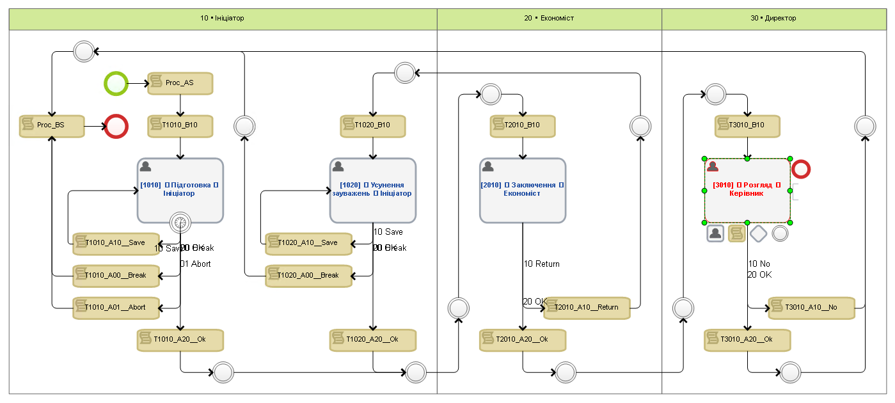

[`🌐 КОНТЕКСТ`](./ProcData/context.md)   [`⚙️ СЦЕНАРІЇ`](./ProcData/scripts.md)   

# Демо процес

Процес створено для демонтстрації підходу до розробки бізнес-процесів ELMA

### Найменування об'єктів процесу

🔶 Назва <ins>зон відповідальності</ins> на діаграмі процесу починається з їх порядкового номеру у форматі `ZZ`, де ZZ - двоцифровий номер зони процесу (у відповідності до послідовності виконання задач процесу) -- що буде використано для привязки назв задач, скриптів, тощо. Нумерація зон відповідальності процесу проводиться з кроком 10 (`10 • Ініціатор`, `20 • Економіст`, `30 • Директор`)
> Таким чином за необхідності внесення нової зони в процес її буде легко вставити між існуючими зберігши послідовність виконання задач процесу, та не переробляючи назви інших зон, задач та скриптів.

🔶 Назва <ins>задач</ins> на діаграмі процесу починається теж з іх порядкового номеру в форматі `ZZTT` де ZZ - двоцифровий номер зони процесу в якій міститься задача, TT - двоцифровий номер задачі. Частина TT в номері задачі (для наступної задачі в цій же ж зоні), як і в нумерації зон процесу теж зростає на 10 (щоб була можливість вставити нову задачу між існуючими): `[1010] 📥 Підготовка 👤 Ініціатор` (зона 10, задача 10), `[1020] 📥 Усунення зауважень 👤 Ініціатор` (зона 10, задача 20), `[2010] 📥 Заключення 👤 Економіст` (зона 20, задача 10), тощо.
> Номера задач активно використовуються при написанні програмного коду, і дають можливість швидко знайти необхідний, пов'язаний із задачею програмний метод (або зрозуміти що він відсутній):  
> T1010_OnLoad — при завантаженні задачі 1010  
> T1010_OnCh__ProcSubject — при зміні властивості на формі задачі 1010

🔶 Назва <ins>переходів</ins> із задач на діаграмі процесу теж починається з іх порядкового номеру в форматі `RR` де RR - двоцифровий номер переходу, для наступного переходу номер збільшується на 10. 
> Номер задачі, разом із номером переходу використовується для прив'язки форм, скриптів переходів та скриптів після переходу:  
> • До переходу `20 OK` задачі `[1010] 📥 Підготовка 👤 Ініціатор` прив'язана форма `[1010_20] 📥 В роботу 👤 Ініціатор`  
> • Після переходу `20 OK` задачі `[1010] 📥 Підготовка 👤 Ініціатор` виконується скрипт `T1010_A20__Ok` (зона 10; задача 10; перехід A20, після задачі)  
> • Безпосередньо на сам перехід `20 OK` задачі `[1010] 📥 Підготовка 👤 Ініціатор` може бути прив'язано скрипт `T1010_A20__IsAllowed` (зона 10; задача 10; перехід A20, після задачі), що перевіряє дані форми дозволяє цей перехід чи ні.  

### Об'єкти діаграми процесу

🔶 На діаграмі процесу розміщено скрипти в яких можна обробити типові події процесу —  після запуску `Proc_AS` та перед зупинкою `Proc_BS`:  
> • `Proc_AS` (process after start) — після запуску процесу  
> • `Proc_BS` (process before stop) — перед зупункою процесу  
> • `Proc_BeforeAbort` (process before abort) — перед перериванням процесу ззовні (відсутній на діаграмі, але прив'язаний до відповідної події процесу) 

🔶 На діаграмі процесу розміщено скрипти в яких можна обробити типові події задач - перед задачею `B` (before) та після задачі `A` (after). Додатково задача із задачею можуть бути пов'язані скрипти під час її виконання чи перед завершенням її виконання.
> Наприклад, для задачі `[1010] 📥 Підготовка 👤 Ініціатор` скрипти  
> ◤ Перед задачею (B, before):  
> • **T1010_B10**   
> ◤ Під час виконання:  
> • **T1010_OnLoad** — при завантаженні форми задачі  
> • **T1010_OnCh__ProcSubject** — при зміні властивості на формі  
> • **T1010_OnCh__BL10_PropertyName** (як приклад) — при зміні властивості блока (BL10) на формі  
> • **T1010_OnCh__BL10a_PropertyName** (як приклад) — при зміні властивості блока (a), що вкладений в інший блок (BL10) на формі  
> ◤ Перед завершенням виконання :  
> • **T1010_A20__IsAllowed** (як приклад) — чи дозволено завершити задачу і виконати перехід (A20)  
> ◤ Після виконання задачі (A, after):  
> • **T1010_A00__Break** — Після виконання переходу A00 (відмінено користувачем)   
> • **T1010_A01__Abort**  — Після виконання переходу A01 (ескалація по таймеру)  
> • **T1010_A10__Save** — Після виконання переходу A10 (оновлення документу процесу і продовження роботи)  
> • **T1010_A20__Ok** — Після виконання переходу A20 (підготовка даних для наступного користувача)